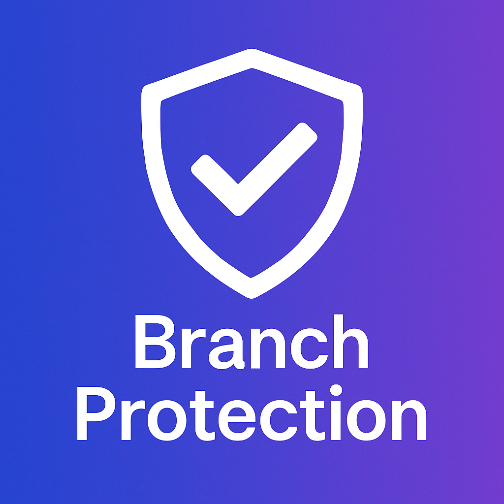

<p align="center">
  
</p>

# Branch Protection GitHub Action


---

## Purpose

This GitHub Action enforces branch protection rules from a YAML file committed to your repository. It’s fully automatable, auditable, and secure - ideal for organizations, open source, and compliance environments.

---

## Features

- Enforce GitHub branch protection from version-controlled YAML
- Apply to any branch, from one config file
- Self-applies via GitHub Actions
- Requires signed commits, code reviews, and CI checks
- Includes security and quality gates (FOSS, SAST, DAST, SCA, secrets)
- Runs pre-commit checks locally
- Supports GitHub Marketplace and community standards

---

## Usage

Add a `.github/branch-protection.yml` file:

```yaml
branches:
  main:
    enforce_admins: true
    required_status_checks:
      strict: true
      contexts:
        - "FOSS License Scan"
        - "CodeQL SAST"
        - "DAST OWASP ZAP"
        - "SCA & Misconfig Scan"
        - "Secrets Scan (TruffleHog)"
        - "Validate branch-protection.yml"
    required_pull_request_reviews:
      dismiss_stale_reviews: true
      required_approving_review_count: 1
      require_code_owner_reviews: true
      require_last_push_approval: true
    required_linear_history: true
    allow_force_pushes: false
    allow_deletions: false
    block_creations: true
    required_conversation_resolution: true
    required_signatures: true
```

Then add this workflow:

```yaml
name: Enforce Branch Protection

on:
  push:
    paths:
      - '.github/branch-protection.yml'
  workflow_dispatch:

jobs:
  protect:
    runs-on: ubuntu-latest
    steps:
      - uses: actions/checkout@v4
      - name: Apply branch protection
        uses: woopstar/branch-protection@v1
        with:
          token: ${{ secrets.GH_ADMIN_TOKEN }}
```

---

## Security & Quality Coverage

| Layer            | Coverage Tool           |
|------------------|--------------------------|
| SAST             | CodeQL                   |
| DAST             | OWASP ZAP                |
| SCA              | Trivy (Filesystem)       |
| Misconfiguration | Trivy (Config Scanner)   |
| License          | GitHub Licensee          |
| Secrets          | TruffleHog + GitHub Native |
| YAML Linting     | yq Validation            |
| Dependency Updates | Dependabot             |
| CI Enforcement   | GitHub Actions + Protection |
| Label Sync       | Label Sync Action        |
| Auto-Merge       | Dependabot Auto Merge    |
| Copilot Settings | Copilot YAML Config      |
| Funding          | GitHub Sponsors / BMC    |
| Release Mgmt     | Release Drafter          |

---

## Local Development

Supports `pre-commit` hooks for:

- Signed commit enforcement
- YAML linting
- Whitespace checks
- Secret detection

See [CONTRIBUTING.md](./CONTRIBUTING.md) for setup instructions.

---

## License

[MIT](./LICENSE)
